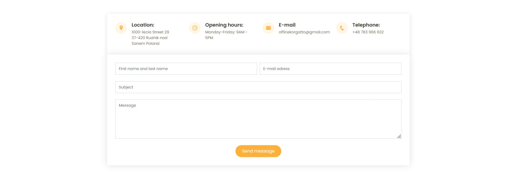

# Korgatto
> Business card one page website for the tailoring company.

## Table of Contents
* [General Info](#general-information)
* [Technologies Used](#technologies-used)
* [Screenshots](#screenshots)
* [Project Status](#project-status)
* [Room for Improvement](#room-for-improvement)

## General Information
- Provide general information about your project here.
- What problem does it (intend to) solve?
- What is the purpose of your project?
- Why did you undertake it?
<!-- You don't have to answer all the questions - just the ones relevant to your project. -->

## Technologies Used
- HTML
- CSS
- PHP
- JavaScript
- Jquery
- Bootstrap
 

Additional libraries and plugins:
- Animate.css
- AOS -Animate on Scroll
- Isotope - layout
- Jquery Sticky
- Jquery Easing
- Owl Carousel
- Validate.js
- Venobox

## Screenshots

## Project Status
Project is _in progress_.

## Room for Improvement

Room for improvement:
- Optimizing the page loading time
- SEO optimization

To do:
- Adding new photos of products
- Adding a simple administration panel that allows to manage some elements on the website

